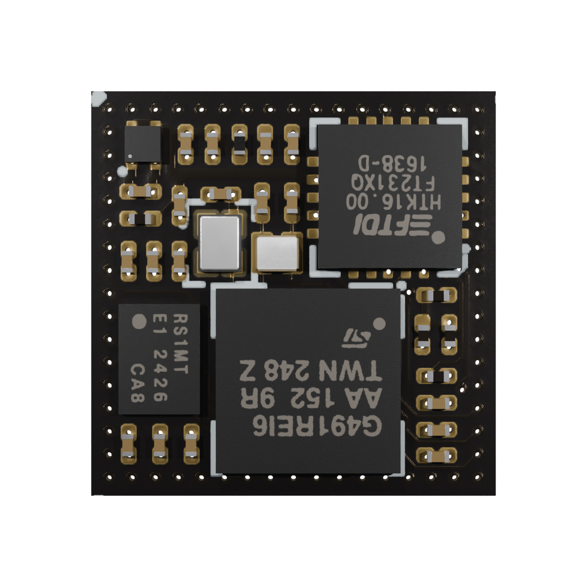

# Myra System-in-Package Interposer

Copyright (c) 2024 [Antmicro](https://www.antmicro.com/)

## Overview

This repository contains open hardware design files for Antmicro's Myra System-in-Package, a compact System-on-Module derived from Antmicro's [Environment Sensor board](https://github.com/antmicro/environment-sensor).
The design replaces the MCU, FRAM and USB to UART converter with a single chip.

The SiP is also used in the [Environment Sensor Myra Baseboard](https://github.com/antmicro/environment-sensor-myra-baseboard) which extends it with temperature, pressure and humidity sensors, a USB-C connector, QWIIC connectors and an RTC battery pickup.

The design files were prepared in KiCad 7.

## Key features

* STM32G491REI6 MCU
* 128kB FRAM
* FT231XQ USB to UART converter
* 11.4 mm X 11.4 mm
* USB interface
* 2 x I2C interface
* SPI interface
* 3 GPIO pins

## Repository structure

The main repository directory contains KiCad PCB project files, a LICENSE and a README.
The remaining files are stored in the following directories:

* `doc` - contains board schematic
* `assets` - contains visual assets for showcasing this design on [Open Hardware Portal](https://openhardware.antmicro.com/boards/myra-sip-interposer/?tab=features&view=top-ortho).

## Licensing
This project is published under the [Apache-2.0](LICENSE) license.
